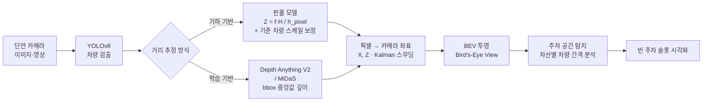

# Monocular Camera-based Parking Space Detection

> 단일 카메라(단안) 영상만으로 주변 차량을 검출하고, 각 차량의 거리·위치를 추정해 **Bird's-Eye View(BEV)** 를 재구성하고, 차량 사이의 빈 공간을 분석해 **주차 가능 공간을 검출**하는 컴퓨터 비전 시스템입니다.


## 개요

LiDAR나 스테레오 카메라 없이 **단일 RGB 카메라 한 대**만으로 주차 환경을 인식하는 것이 목표입니다. 전체 파이프라인은 다음과 같습니다.

1. **차량 검출** — YOLOv8로 프레임 내 `car`, `truck`, `bus`를 검출
2. **단안 거리 추정** — 두 가지 방식 지원
   - *기하 기반*: 핀홀 카메라 모델 `Z = f · H / h_pixel` + 기준 차량 스케일 보정
   - *학습 기반*: Depth Anything V2 / MiDaS로 밀집 깊이맵 추정 후 bbox 내부 중앙값 사용
3. **좌표 변환 & 스무딩** — 픽셀 → 카메라 좌표 `(X, Z)` 변환, Kalman 필터로 깊이 지터 완화
4. **BEV 재구성** — 검출 차량을 상단 시점(BEV) 격자 위에 투영
5. **주차 공간 탐지** — 차선별로 차량을 정렬하고, 차량 사이 간격이 기준치 이상인 구간을 빈 슬롯으로 판정



---

## 데모


---

## 핵심 방법

### 1. 단안 거리 추정 — 기하 기반
알려진 차량 높이(`CAR_HEIGHT = 1.7 m`)와 bbox의 세로 픽셀 크기를 이용해 거리를 추정합니다.

```
Z = f_y · H_car / h_pixel
```

단안 카메라는 절대 스케일을 알 수 없으므로, **첫 프레임에서 기준 차량 1대가 18 m 거리에 있다고 가정**(`REF_DISTANCE_M = 18.0`)하여 스케일을 1회 보정합니다. 기준 차량은 화면상 가장 오른쪽·가장 가까운 차량으로 선택됩니다.

### 2. 단안 거리 추정 — 학습 기반
Depth Anything V2(`vitl`) 또는 MiDaS로 프레임 전체의 밀집 깊이맵을 추론하고, 각 bbox 하단 영역의 **중앙값 깊이**를 거리로 사용합니다. 기하 가정에 덜 의존한다는 장점이 있습니다.

### 3. 좌표 변환 · 스무딩
`X = (u − c_x) / f_x · Z` 로 횡방향 위치를 계산하고, 객체별 1D Kalman 필터로 깊이(Z)의 프레임 간 지터를 완화합니다. yaw는 bbox 종횡비로 근사 후 EMA로 부드럽게 처리합니다.

### 4. BEV 투영 & 주차 공간 탐지
차량을 BEV 격자에 배치한 뒤, 검출 결과를 `X` 부호 기준 좌·우 차선으로 나누고 각 차선을 `Z`(거리)로 정렬합니다. 이후 **연속한 두 차량 사이 간격이 기준치(`min_gap = 7 m`) 이상**이면 해당 구간을 주차 가능 슬롯으로 판정해 시각화합니다. (차량 길이 5 m 기준, 약 7 m 이상이면 진입 가능하다고 가정)

---

## 프로젝트 구조

### 공용 모듈
| 파일 | 설명 |
|---|---|
| `bev_map.py` | **핵심.** BEV 캔버스·차선·자차 렌더링, 주차 슬롯 탐지(`find_parking_slots`) 및 시각화 |
| `bev_map2.py` | BEV 대안 버전 — 기준 차량 상대 깊이 기반, 원형 마커 + 디버그 로그 |
| `utils_3d.py` | KITTI 스타일 3D 박스 8-corner 계산, 이미지 투영, 3D 박스 그리기 |

### 기하 기반 거리 추정 파이프라인
| 파일 | 입력 | 특징 |
|---|---|---|
| `picture.py` | 이미지 1장 | 단일 프레임 검출 + BEV |
| `vision.py` | 비디오/실시간 | 기본 파이프라인 |
| `vison_video.py` | 비디오 | 비디오 재생 처리 |
| `vision_project.py` | 비디오 | 실제 재생 속도 시간 동기화 |
| `vision_project2.py` | 비디오 | **가장 완성형** — Kalman 필터로 깊이 스무딩 추가 |

### 학습 기반 깊이 추정 파이프라인
| 파일 | 깊이 모델 | 특징 |
|---|---|---|
| `project.py` | Depth Anything V2 | YOLOv8 + 밀집 깊이 → 3D 박스 |
| `test.py` | Depth Anything V2 | YOLOv8 + 깊이 기반 거리 추정 |
| `video_yolo.py` | MiDaS | YOLOv8 + MiDaS → BEV |

---

## 설치

```bash
git clone https://github.com/26720726a/Monocular-camera-based-parking-space-detection.git
cd Monocular-camera-based-parking-space-detection

pip install opencv-python numpy torch torchvision ultralytics
```

YOLOv8 가중치(`yolov8n.pt`)는 최초 실행 시 자동으로 내려받아집니다.

**학습 기반 깊이 모델을 사용하는 스크립트**(`project.py`, `test.py`, `video_yolo.py`)는 별도 설정이 필요합니다.
- **Depth Anything V2**: [공식 저장소](https://github.com/DepthAnything/Depth-Anything-V2) 설치 후 체크포인트(`depth_anything_v2_vitl.pth`)를 `checkpoints/`에 배치
- **MiDaS**: [공식 저장소](https://github.com/isl-org/MiDaS)의 `midas` 모듈 및 가중치 필요

> 모델 체크포인트는 용량 문제로 저장소에 포함되어 있지 않습니다.

---

## 실행

각 스크립트 상단의 **카메라 내부 파라미터**(`FX, FY, CX, CY`)와 **입력 경로**를 사용 환경에 맞게 수정한 뒤 실행하세요.

```bash
# 이미지 1장 (기하 기반)
python picture.py

# 비디오 + Kalman 스무딩 (기하 기반, 권장)
python vision_project2.py

# 학습 기반 깊이(Depth Anything V2) + 3D 박스
python project.py

# 학습 기반 깊이(MiDaS) + BEV
python video_yolo.py
```

> **참고:** 현재 입력 경로가 코드 내부에 하드코딩되어 있습니다(예: `cv2.VideoCapture("...")`). 실행 전 본인의 이미지/영상 경로로 변경해야 합니다.

조작키: `q` 또는 `ESC` — 종료

---

## 한계 및 향후 개선

**현재 한계**
- 카메라 내부 파라미터와 차량 크기를 **고정값으로 가정** — 실제 캘리브레이션 없이는 절대 거리에 오차가 존재
- 기하 기반 스케일 보정이 첫 프레임의 특정 기준 차량에 의존 — 기준 차량이 없거나 가려지면 실패 가능
- 깊이 스무딩은 `u // 30` 기반 간이 ID를 사용 — 완전한 다중 객체 추적(MOT)은 아님
- yaw는 bbox 종횡비 기반 근사 — 정밀 자세 추정에는 한계
- 주차 판정이 BEV 상 **차량 간격 휴리스틱** — 실제 노면 주차선을 직접 인식하지는 않음

**향후 개선 방향**
- 실제 카메라 캘리브레이션(체스보드) 적용으로 절대 거리 정확도 향상
- ByteTrack/DeepSORT 등 정식 다중 객체 추적기 결합
- 학습 기반 깊이의 metric-scale 보정
- 주차선·노면 마킹 세그멘테이션을 결합한 하이브리드 판정

---

## 기술 스택

`Python` · `OpenCV` · `PyTorch` · `YOLOv8 (Ultralytics)` · `Depth Anything V2` · `MiDaS` · `NumPy`

## License

이 저장소에는 별도의 라이선스 파일이 없습니다. 사용·배포 조건은 저장소 소유자에게 문의하세요. (사용된 YOLOv8, Depth Anything V2, MiDaS는 각자의 라이선스를 따릅니다.)
